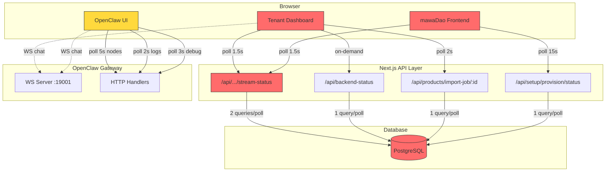
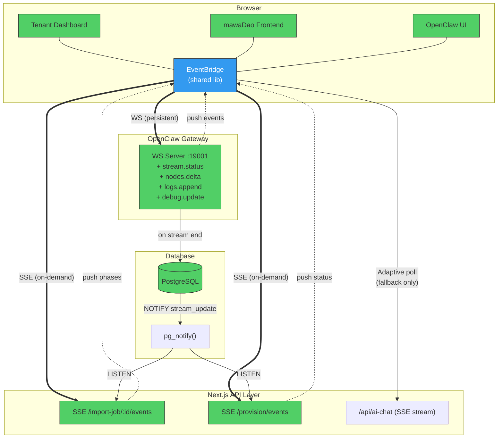
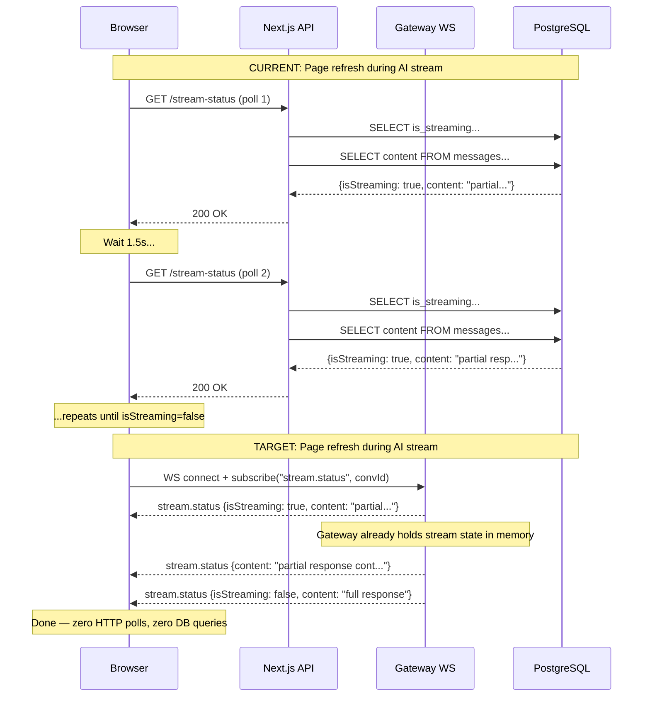
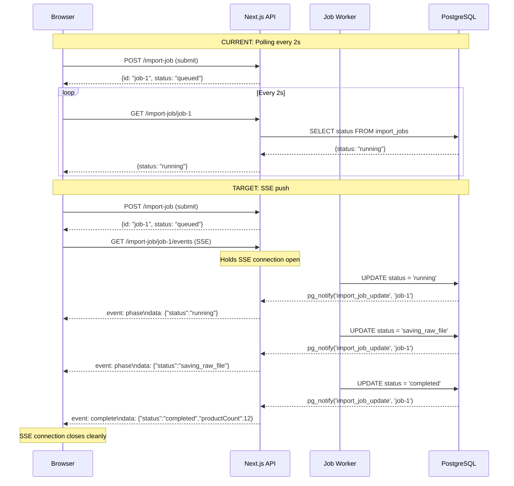

# mawaDao Platform — Realtime Architecture Redesign

> **Author:** Principal Staff Engineer  
> **Status:** RFC / Architecture Proposal  
> **Scope:** Platform-wide realtime communication — eliminate excessive polling, reduce cold-start UX, improve scalability

---

## Table of Contents

1. [Executive Summary](#1-executive-summary)
2. [Current State Diagnosis](#2-current-state-diagnosis)
3. [Target Architecture](#3-target-architecture)
4. [Architecture Diagrams](#4-architecture-diagrams)
5. [Protocol Design](#5-protocol-design)
6. [Implementation Plan](#6-implementation-plan)
7. [Migration Strategy](#7-migration-strategy)
8. [Security Considerations](#8-security-considerations)
9. [Cost Comparison](#9-cost-comparison)
10. [Observability](#10-observability)
11. [Operational Runbook](#11-operational-runbook)

---

## 1. Executive Summary

The mawaDao platform currently relies on **11+ distinct polling loops** across 4 frontend applications to maintain UI state. These polls fire between every **1.5s–15s**, generating unnecessary HTTP round-trips, database queries, and Cloud Run instance-seconds. This document proposes migrating to an **event-driven architecture** using the platform's existing WebSocket infrastructure, supplemented by SSE for Next.js API routes, and adaptive polling as a fallback.

### Key Outcomes

| Metric | Current | Target | Improvement |
|--------|---------|--------|-------------|
| HTTP polls/user/minute (active chat) | ~80 | ~2 | **97.5% reduction** |
| DB queries for stream-status/min | ~40 | 0 | **100% elimination** |
| Cold-start perceived latency | 2–15s | <500ms | **Skeleton + optimistic** |
| Cloud Run billable instance-seconds | Baseline | -30–50% | **Cost reduction** |

---

## 2. Current State Diagnosis

### 2.1 Polling Inventory

| # | Location | Endpoint | Interval | Condition | Severity |
|---|----------|----------|----------|-----------|----------|
| P1 | `tenant-dashboard` chat | `/api/conversations/{id}/stream-status` | **1.5s** | `isStreamRecovery === true` | 🔴 Critical |
| P2 | `tenant-dashboard` chat | `/api/conversations/{id}/stream-status` | **1.5s** (max 30s) | Post-stream DB sync | 🔴 Critical |
| P3 | `openclaw-ui` control panel | `/api/nodes` (gateway WS) | **5s** | Always when panel open | 🟡 Medium |
| P4 | `openclaw-ui` control panel | `/api/logs` (gateway WS) | **2s** | `tab === "logs"` | 🟡 Medium |
| P5 | `openclaw-ui` control panel | `/api/debug` (gateway WS) | **3s** | `tab === "debug"` | 🟡 Medium |
| P6 | `tenant-dashboard` import modal | `/api/products/import-job/{id}` | **2s** | Job active | 🟠 High |
| P7 | `mawadao-frontend` chat | `/api/setup/provision/status` | **15s** | During provisioning | 🟢 Low |
| P8 | `tenant-dashboard` chat | `/api/backend-status` | On-demand | `IS_CLOUD` mode | 🟢 Low |
| P9 | `mawadao-frontend` chat | `/api/conversations/{id}/stream-status` | **1.5s** | Stream recovery | 🔴 Critical |
| P10 | `mawadao-frontend` chat | Provision animation | **2.5s** | Client-only timers | ⚪ N/A |
| P11 | `tenant-dashboard` social accounts | OAuth callback check | **2–5s** | During OAuth flow | 🟢 Low |

### 2.2 Stream Recovery Deep Dive (P1 + P2 — Highest Impact)

**Current flow:**

```
Browser refresh during AI stream → isStreamRecovery = true
  → setInterval(1.5s) → GET /api/conversations/{id}/stream-status
    → SQL: SELECT is_streaming, streaming_started_at FROM conversations WHERE id=$1
    → SQL: SELECT content FROM messages WHERE conversation_id=$1 AND role='assistant' ORDER BY created_at DESC LIMIT 1
  → If isStreaming: update last assistant message parts in React state
  → If !isStreaming: setRecovering(false), clear interval
```

**Problems:**
- 2 SQL queries per poll × 40 polls/min = **80 DB queries/min per recovering user**
- 10-minute stale guard means a stuck stream generates **800 wasted DB queries** before auto-clearing
- Post-stream sync (P2) fires 20 additional polls after *every* chat response, even when content is already complete
- No deduplication — multiple tabs = multiplied polls

### 2.3 OpenClaw Control Panel Polling (P3–P5)

The OpenClaw UI already connects to the gateway via WebSocket (`openclaw-ws-chat.ts`), yet the control panel uses HTTP polling for nodes/logs/debug. The gateway's `broadcast()` function can push these events directly.

**Current waste:** A developer with the control panel open and logs tab active generates:
- Nodes: 12 polls/min
- Logs: 30 polls/min  
- Total: **42 HTTP requests/min** (all could be 0 with WS push)

### 2.4 Import Job Polling (P6)

The marketplace import flow polls a job status endpoint every 2s through 7 distinct phases. This is a textbook SSE use case — the server knows when each phase transition occurs and could push updates instead of waiting for the next poll.

### 2.5 Architecture Friction Points

| Issue | Root Cause | Impact |
|-------|------------|--------|
| Tenant-dashboard chat uses Next.js API routes, not gateway WS | AI SDK's `TextStreamChatTransport` requires HTTP | Cannot leverage gateway events for stream recovery |
| Cloud Run scale-to-zero | Serverless model | Cold starts add 2–15s latency for first request |
| No shared event bus between Next.js and gateway | Separate processes | State synchronization requires polling |
| No connection multiplexing | Each frontend creates independent WS/HTTP connections | Redundant auth, connection overhead |

---

## 3. Target Architecture

### 3.1 Communication Tiers

```
┌─────────────────────────────────────────────────────────────────┐
│                    COMMUNICATION TIER MODEL                      │
├──────────┬──────────────────────┬───────────────────────────────┤
│ Tier     │ Transport            │ Use Cases                     │
├──────────┼──────────────────────┼───────────────────────────────┤
│ Tier 1   │ WebSocket (existing) │ Chat messages, node status,   │
│ Realtime │ Gateway port 19001   │ logs, debug, presence,        │
│          │                      │ exec approvals, health        │
├──────────┼──────────────────────┼───────────────────────────────┤
│ Tier 2   │ SSE (new)            │ Import job progress,          │
│ Streamed │ Next.js API routes   │ stream recovery content,      │
│          │                      │ provision status              │
├──────────┼──────────────────────┼───────────────────────────────┤
│ Tier 3   │ Adaptive Poll (new)  │ OAuth callback (short-lived), │
│ Fallback │ Exponential backoff  │ Backend status check,         │
│          │                      │ WS reconnection fallback      │
└──────────┴──────────────────────┴───────────────────────────────┘
```

### 3.2 Design Principles

1. **Push-first:** Server pushes events; clients never poll for data the server already knows changed
2. **Delta sync:** Only transmit changed data, not full state snapshots
3. **Graceful degradation:** SSE/WS failure → adaptive polling with exponential backoff
4. **Connection reuse:** Multiplex events over existing WS connections where possible
5. **Circuit breaker:** Disable push channels after N failures; re-enable via health probe
6. **Feature flags:** Every transport change is gated behind a runtime flag for safe rollout

### 3.3 Component Responsibilities

#### 3.3.1 `EventBridge` (New — Shared Library)

A lightweight event bus that abstracts the transport layer. Each frontend imports this:

```typescript
// packages/event-bridge/src/index.ts
interface EventBridgeConfig {
  wsUrl?: string;           // Gateway WS (Tier 1)
  sseEndpoints?: Record<string, string>;  // Tier 2 endpoints
  fallbackPollInterval?: number;           // Tier 3 default
  circuitBreaker?: { threshold: number; resetMs: number };
  featureFlags?: Record<string, boolean>;
}

interface EventBridge {
  subscribe(channel: string, handler: (event: BridgeEvent) => void): Unsubscribe;
  getConnectionState(): 'connected' | 'reconnecting' | 'degraded' | 'disconnected';
  getMetrics(): ConnectionMetrics;
}
```

#### 3.3.2 Gateway WS Extensions (Tier 1)

Add new event types to the existing gateway protocol v3:

| Event | Payload | Replaces |
|-------|---------|----------|
| `stream.status` | `{ conversationId, isStreaming, content?, messageId? }` | P1, P2 stream-status polling |
| `nodes.delta` | `{ added: Node[], removed: string[], updated: Node[] }` | P3 node polling |
| `logs.append` | `{ entries: LogEntry[] }` | P4 log polling |
| `debug.update` | `{ snapshot: DebugState }` | P5 debug polling |

#### 3.3.3 SSE Endpoints (Tier 2)

| Endpoint | Purpose | Replaces |
|----------|---------|----------|
| `GET /api/products/import-job/{id}/events` | Job phase transitions | P6 import polling |
| `GET /api/setup/provision/events` | Provision progress | P7 provision polling |

#### 3.3.4 Adaptive Polling Utility (Tier 3)

```typescript
// packages/event-bridge/src/adaptive-poll.ts
interface AdaptivePollConfig {
  initialInterval: number;    // e.g. 2000ms
  maxInterval: number;        // e.g. 30000ms
  backoffFactor: number;      // e.g. 1.5
  resetOnActivity: boolean;   // Reset to initial after server indicates change
  maxAttempts?: number;       // Auto-stop after N polls
  condition?: () => boolean;  // Only poll when true
}
```

Replaces raw `setInterval` loops. Exponentially backs off when responses indicate no change, resets to fast polling on change detection.

---

## 4. Architecture Diagrams

### 4.1 Current Architecture (Polling)



### 4.2 Target Architecture (Event-Driven)



### 4.3 Stream Recovery — Before vs. After



### 4.4 Import Job Progress — Before vs. After



---

## 5. Protocol Design

### 5.1 Gateway WS Protocol Extensions

The gateway already uses protocol v3 with `{type, event, payload}` frames. We extend with new event types:

```typescript
// New gateway events (add to GATEWAY_EVENTS array)

// Stream status — replaces stream-status polling
interface StreamStatusEvent {
  type: "event";
  event: "stream.status";
  payload: {
    conversationId: string;
    isStreaming: boolean;
    content?: string;       // Latest assistant message content
    messageId?: string;
    phase: "streaming" | "finalizing" | "complete";
  };
}

// Node delta — replaces node list polling
interface NodesDeltaEvent {
  type: "event";
  event: "nodes.delta";
  payload: {
    version: number;        // Monotonic version for ordering
    added: NodeInfo[];
    removed: string[];      // Node IDs
    updated: Partial<NodeInfo & { id: string }>[];
  };
}

// Log append — replaces log polling
interface LogsAppendEvent {
  type: "event";
  event: "logs.append";
  payload: {
    entries: LogEntry[];
    cursor: string;         // For catch-up on reconnect
  };
}

// Debug update — replaces debug polling
interface DebugUpdateEvent {
  type: "event";
  event: "debug.update";
  payload: {
    snapshot: Record<string, unknown>;
    version: number;
  };
}
```

### 5.2 SSE Wire Format

```
# Import job events
event: phase
data: {"jobId":"abc","status":"uploading_to_bucket","progress":0.65}

event: complete
data: {"jobId":"abc","status":"completed","productCount":12,"errorCount":0}

event: error
data: {"jobId":"abc","status":"failed","errorMessage":"Upload timeout"}

# Heartbeat (every 30s to prevent proxy/LB timeout)
: heartbeat

# Provision events
event: status
data: {"ready":false,"reason":"provisioning","phase":"deploying"}

event: ready
data: {"ready":true,"backendUrl":"https://tenant.mawadao.com"}
```

### 5.3 EventBridge Client API

```typescript
import { createEventBridge } from '@mawadao/event-bridge';

const bridge = createEventBridge({
  ws: {
    url: process.env.NEXT_PUBLIC_GATEWAY_WS_URL,
    reconnect: { maxDelay: 30_000, backoffFactor: 1.5 },
  },
  circuitBreaker: { threshold: 5, resetMs: 60_000 },
  featureFlags: {
    'realtime.stream-status': true,   // Phase 1
    'realtime.import-sse': false,     // Phase 2 (not yet)
    'realtime.nodes-delta': false,    // Phase 3
  },
});

// Subscribe to stream recovery — replaces setInterval poll
const unsub = bridge.subscribe('stream.status', (event) => {
  if (event.payload.conversationId === currentConvId) {
    updateMessages(event.payload.content);
    if (!event.payload.isStreaming) {
      setRecovering(false);
    }
  }
});

// Cleanup
useEffect(() => unsub, []);
```

---

## 6. Implementation Plan

### Phase 1: Stream Recovery → Gateway WS Push (Highest Impact)

**Priority:** 🔴 Critical — eliminates ~80 DB queries/min per recovering user

**Changes:**

| File | Change |
|------|--------|
| `gateway/src/gateway/server-methods/chat/` | Emit `stream.status` event when AI stream writes to buffer |
| `gateway/src/gateway/server-runtime-state.ts` | Add `streamStatusSubscriptions` map to track which clients care about which conversations |
| `tenant-dashboard/src/lib/openclaw-ws-chat.ts` | Add `subscribeStreamStatus(convId)` method |
| `tenant-dashboard/src/components/chat/index.tsx` | Replace `setInterval(poll, 1500)` blocks with WS subscription |
| `mawadao-frontend/src/components/chat/index.tsx` | Same replacement |
| `tenant-dashboard/src/app/api/conversations/[id]/stream-status/route.ts` | Keep as fallback; add `Cache-Control: no-store` header |

**Feature flag:** `NEXT_PUBLIC_REALTIME_STREAM_STATUS=ws|poll` (default: `poll`)

**Rollback:** Flip flag to `poll` — original polling code remains behind the flag.

### Phase 2: Import Job → SSE (High Impact)

**Priority:** 🟠 High — eliminates polling for long-running import jobs

**Changes:**

| File | Change |
|------|--------|
| `tenant-dashboard/src/app/api/products/import-job/[id]/events/route.ts` | **New** SSE endpoint using `pg_notify` listener |
| `tenant-dashboard/src/components/import-market-modal.tsx` | Replace `setInterval(2000)` with `EventSource` connection |
| Database migration | Add `NOTIFY` trigger on `import_jobs` table status updates |

**Feature flag:** `NEXT_PUBLIC_REALTIME_IMPORT_SSE=true|false` (default: `false`)

### Phase 3: OpenClaw Control Panel → WS Push (Medium Impact)

**Priority:** 🟡 Medium — eliminates 42 HTTP requests/min per developer

**Changes:**

| File | Change |
|------|--------|
| `gateway/src/gateway/server-methods/` | Add `nodes.subscribe`, `logs.subscribe`, `debug.subscribe` handlers |
| `openclaw-ui/ui/src/ui/app-polling.ts` | Replace with WS event subscriptions |
| Gateway broadcast logic | Emit `nodes.delta` on node register/unregister, `logs.append` on new log entries |

**Feature flag:** `OPENCLAW_REALTIME_CONTROL_PANEL=ws|poll` (default: `poll`)

### Phase 4: Adaptive Polling Utility (Low Priority, High Value)

**Priority:** 🟢 Low urgency but improves remaining polls

Replace all remaining raw `setInterval` loops with the `AdaptivePoll` utility:

```typescript
const poll = new AdaptivePoll({
  fn: () => fetch('/api/backend-status').then(r => r.json()),
  initialInterval: 2000,
  maxInterval: 30000,
  backoffFactor: 1.5,
  shouldContinue: (data) => !data.ready,
  onData: (data) => setBackendReady(data.ready),
});

poll.start();
// Auto-stops when shouldContinue returns false
```

Applies to: P7 (provision status), P8 (backend status), P11 (OAuth callback).

### Phase 5: Cold-Start Mitigation

**Priority:** 🟢 Low — improves UX but not a polling issue

| Strategy | Implementation |
|----------|---------------|
| Skeleton screens | Show chat skeleton immediately, hydrate when backend responds |
| Optimistic UI | Render user message immediately, don't wait for backend ack |
| Connection pre-warming | Initiate WS connection on page load before user interaction |
| Min instances | Configure Cloud Run `--min-instances=1` for critical services |

---

## 7. Migration Strategy

### 7.1 Feature Flag Matrix

```typescript
// lib/feature-flags.ts
export const REALTIME_FLAGS = {
  // Phase 1
  'realtime.stream-status': env('NEXT_PUBLIC_REALTIME_STREAM_STATUS', 'poll'), // 'ws' | 'poll'
  // Phase 2
  'realtime.import-sse': env('NEXT_PUBLIC_REALTIME_IMPORT_SSE', 'false'),      // 'true' | 'false'
  // Phase 3
  'realtime.control-panel': env('OPENCLAW_REALTIME_CONTROL_PANEL', 'poll'),    // 'ws' | 'poll'
} as const;
```

### 7.2 Rollout Plan

```
Week 1-2: Phase 1 implementation + internal testing
  → Deploy with flag = 'poll' (no change for users)
  → Enable flag = 'ws' for dev/staging
  → Validate via metrics dashboard

Week 3: Phase 1 canary rollout
  → Enable flag = 'ws' for 10% of users
  → Monitor: WS connection stability, stream recovery success rate
  → If error rate > 1%: auto-rollback to 'poll'

Week 4: Phase 1 GA + Phase 2 implementation
  → Flag = 'ws' for 100%
  → Begin Phase 2 SSE implementation

Week 5-6: Phase 2 + Phase 3 implementation
  → Same canary rollout pattern

Week 7-8: Phase 4 + Phase 5
  → Utility adoption, cold-start improvements
```

### 7.3 Dual-Mode Component Pattern

```typescript
// Example: Stream recovery with feature flag
function useStreamRecovery(conversationId: string, userId: string) {
  const mode = useFeatureFlag('realtime.stream-status');

  if (mode === 'ws') {
    return useWsStreamRecovery(conversationId);
  }
  return usePollStreamRecovery(conversationId, userId);
}

// WS-based (new)
function useWsStreamRecovery(conversationId: string) {
  const [recovering, setRecovering] = useState(false);
  const wsChat = useOpenClawWsChat();

  useEffect(() => {
    if (!recovering || !conversationId) return;
    const unsub = wsChat.subscribeStreamStatus(conversationId, (event) => {
      if (event.content) updateLastAssistantMessage(event.content);
      if (!event.isStreaming) setRecovering(false);
    });
    return unsub;
  }, [recovering, conversationId]);

  return { recovering, setRecovering };
}

// Poll-based (existing, preserved)
function usePollStreamRecovery(conversationId: string, userId: string) {
  // ... existing setInterval logic, unchanged
}
```

---

## 8. Security Considerations

### 8.1 WebSocket Authentication

The gateway already authenticates WS connections during the `connect.challenge` handshake. Ensure:

- **Conversation-scoped subscriptions:** A client can only subscribe to `stream.status` for conversations they own. Validate `userId` matches conversation owner before adding to subscription set.
- **Rate limiting:** Max 10 event subscriptions per WS connection. Reject excess with `{type: "error", code: "SUBSCRIPTION_LIMIT"}`.
- **Token refresh:** If WS connection outlives the JWT, require re-authentication via `connect.refresh` before honoring new subscriptions.

### 8.2 SSE Endpoint Security

- All SSE endpoints require the same authentication as their polling counterparts (`getRequestUserId()` / `authenticateRequest()`).
- SSE connections must validate resource ownership (job belongs to user, provision belongs to tenant).
- Add `X-Content-Type-Options: nosniff` header to SSE responses.
- Implement connection limits: max 3 concurrent SSE connections per user.

### 8.3 Event Data Minimization

- `stream.status` events carry message content. Ensure content is only sent to the conversation owner.
- `logs.append` may contain sensitive runtime data. Only push to authenticated control panel sessions.
- Never include credentials, API keys, or PII in broadcast events.

### 8.4 CSP Updates

The existing CSP already allows `wss://*.mawadao.com` and `ws://localhost:19001`. No CSP changes needed for Tier 1. SSE endpoints are same-origin — no changes needed for Tier 2.

---

## 9. Cost Comparison

### 9.1 Cloud Run Cost Model

Cloud Run charges per **instance-second** (CPU allocated while handling requests). Polling creates continuous request load that keeps instances alive.

### 9.2 Per-User Cost Breakdown (Active Chat Session, 10 min)

| Component | Current (Polling) | Target (Event-Driven) | Savings |
|-----------|-------------------|----------------------|---------|
| Stream recovery (P1+P2) | 400 HTTP requests, 800 DB queries | 0 HTTP, 0 DB queries | **100%** |
| Import job (P6) | ~60 HTTP requests, 60 DB queries | 1 SSE connection, ~7 push events | **~98%** |
| Control panel (P3-P5) | 420 HTTP requests/10min | 0 HTTP (WS push) | **100%** |
| Backend status (P8) | ~5 HTTP requests | ~5 (adaptive, unchanged) | 0% |
| **Total HTTP requests** | **~885** | **~12** | **98.6%** |
| **Total DB queries** | **~865** | **~12** | **98.6%** |

### 9.3 Aggregate Impact (100 concurrent users)

| Metric | Current | Target |
|--------|---------|--------|
| HTTP requests/min | ~8,850 | ~120 |
| DB queries/min | ~8,650 | ~120 |
| Cloud Run instances needed | 3-5 (kept alive by polling) | 1-2 (idle between pushes) |
| Estimated Cloud Run cost/month | $X | ~$0.5X–0.7X |

### 9.4 WebSocket Cost Tradeoff

WS connections require persistent instances. However:
- The gateway is **not** on Cloud Run — it's a persistent Node.js process
- WS connections are already maintained for chat — adding event subscriptions has near-zero marginal cost
- SSE on Next.js Cloud Run will keep instances alive, but only for the duration of active jobs (not continuous polling)

---

## 10. Observability

### 10.1 Metrics to Track

```typescript
// EventBridge metrics (client-side)
interface ConnectionMetrics {
  transport: 'ws' | 'sse' | 'poll';
  connectedAt: number;
  reconnectCount: number;
  eventsReceived: number;
  lastEventAt: number;
  circuitBreakerState: 'closed' | 'open' | 'half-open';
  latencyP50: number;
  latencyP99: number;
}
```

### 10.2 Server-Side Metrics

| Metric | Description | Alert Threshold |
|--------|-------------|-----------------|
| `gateway.ws.connections` | Active WS connections | > 10,000 |
| `gateway.ws.subscriptions` | Active event subscriptions | > 50,000 |
| `gateway.events.broadcast_rate` | Events broadcast/sec | > 1,000/sec |
| `gateway.events.dropped` | Events dropped (slow clients) | > 10/min |
| `api.sse.connections` | Active SSE connections | > 500 |
| `api.poll.requests` | Legacy poll requests (should decrease) | Increasing after flag flip |
| `api.stream_status.queries` | DB queries for stream-status | Should → 0 after Phase 1 |

### 10.3 Dashboard Queries

```sql
-- Monitor polling elimination progress
SELECT
  date_trunc('hour', created_at) as hour,
  COUNT(*) FILTER (WHERE path LIKE '%stream-status%') as stream_status_polls,
  COUNT(*) FILTER (WHERE path LIKE '%import-job%' AND method = 'GET') as import_polls,
  COUNT(*) as total_requests
FROM request_logs
WHERE created_at > NOW() - INTERVAL '24 hours'
GROUP BY 1
ORDER BY 1;
```

---

## 11. Operational Runbook

### 11.1 Emergency: WS Push Not Delivering Events

**Symptoms:** Users report stale data, stream recovery stuck  
**Check:**
1. Gateway logs: `grep "stream.status" gateway.log | tail -20`
2. Active subscriptions: Gateway admin → `/debug/subscriptions`
3. Client-side: `localStorage.getItem('eventbridge:metrics')` in browser console

**Mitigate:**
1. Flip feature flag: `NEXT_PUBLIC_REALTIME_STREAM_STATUS=poll`
2. This immediately restores polling behavior — no restart needed
3. Investigate gateway event emission path

### 11.2 Emergency: SSE Connections Exhausting Cloud Run Instances

**Symptoms:** 502/503 errors, high instance count, SSE connections timing out  
**Check:**
1. Cloud Run console → instance count, request count
2. `gcloud run services describe tenant-dashboard --format='value(status.traffic)'`

**Mitigate:**
1. Flip feature flag: `NEXT_PUBLIC_REALTIME_IMPORT_SSE=false`
2. Falls back to polling
3. Consider increasing Cloud Run concurrency limit or max instances

### 11.3 Monitoring: Verifying Polling Elimination

After each phase rollout, verify polling is actually decreasing:

```bash
# Check stream-status endpoint hit rate (should approach 0 after Phase 1)
gcloud logging read \
  'resource.type="cloud_run_revision" AND httpRequest.requestUrl=~"stream-status"' \
  --limit=100 --format='table(timestamp, httpRequest.requestUrl)'
```

### 11.4 Circuit Breaker States

```
CLOSED → (5 consecutive failures) → OPEN → (60s cooldown) → HALF-OPEN → (1 success) → CLOSED
                                       ↑                        |
                                       └── (failure) ───────────┘

In OPEN state: EventBridge automatically falls back to adaptive polling.
In HALF-OPEN: Sends one probe request. If successful → CLOSED. If failed → OPEN.
```

### 11.5 Graceful Degradation Chain

```
WS Push (Tier 1) ──fails──→ SSE (Tier 2) ──fails──→ Adaptive Poll (Tier 3)
     ↑                           ↑                          |
     └── circuit breaker ────────┘── circuit breaker ───────┘
         resets                      resets
```

---

## Appendix A: Files to Modify (Complete List)

### Phase 1 — Stream Recovery

| File | Action |
|------|--------|
| `apps/microservices/openclaw-gateway/src/gateway/server-runtime-state.ts` | Add stream subscription tracking |
| `apps/microservices/openclaw-gateway/src/gateway/server/ws-connection.ts` | Handle `stream.status.subscribe` requests |
| `apps/microservices/openclaw-gateway/src/gateway/server-methods/` | Emit `stream.status` events during chat streaming |
| `apps/frontend/tenant-dashboard/src/lib/openclaw-ws-chat.ts` | Add `subscribeStreamStatus()` |
| `apps/frontend/tenant-dashboard/src/components/chat/index.tsx` | Replace polling with WS subscription |
| `apps/frontend/mawadao-frontend/src/components/chat/index.tsx` | Same |
| `apps/frontend/tenant-dashboard/src/lib/feature-flags.ts` | **New** — feature flag utility |

### Phase 2 — Import Job SSE

| File | Action |
|------|--------|
| `apps/frontend/tenant-dashboard/src/app/api/products/import-job/[id]/events/route.ts` | **New** — SSE endpoint |
| `apps/frontend/tenant-dashboard/src/components/import-market-modal.tsx` | Replace polling with EventSource |
| Database migration | Add `NOTIFY` trigger |

### Phase 3 — Control Panel

| File | Action |
|------|--------|
| `_mc-reference/frontend/src/ui/app-polling.ts` (OpenClaw UI) | Replace with WS subscriptions |
| Gateway server methods | Add node/log/debug push handlers |

### Phase 4 — Adaptive Polling

| File | Action |
|------|--------|
| `packages/event-bridge/src/adaptive-poll.ts` | **New** — shared utility |
| Various components using `setInterval` | Migrate to `AdaptivePoll` |

---

## Appendix B: Gateway Event Catalog (Post-Migration)

| Event | Direction | Protocol | Description |
|-------|-----------|----------|-------------|
| `connect.challenge` | S→C | WS | Handshake initiation |
| `connect` | C→S | WS | Client auth response |
| `presence` | S→C | WS | User/node presence changes |
| `health` | S→C | WS | System health broadcasts |
| `chat.delta` | S→C | WS | Streaming chat token |
| `chat.final` | S→C | WS | Complete chat response |
| `chat.aborted` | S→C | WS | Chat stream aborted |
| `chat.error` | S→C | WS | Chat error |
| **`stream.status`** | **S→C** | **WS** | **Stream recovery state (NEW)** |
| **`nodes.delta`** | **S→C** | **WS** | **Node list changes (NEW)** |
| **`logs.append`** | **S→C** | **WS** | **New log entries (NEW)** |
| **`debug.update`** | **S→C** | **WS** | **Debug state snapshot (NEW)** |
| `exec.approval` | S→C | WS | Execution approval request |

---

## Appendix C: Decision Log

| Decision | Alternatives Considered | Rationale |
|----------|------------------------|-----------|
| Use existing gateway WS for stream status instead of separate SSE | SSE from Next.js, Redis pub/sub | Gateway already holds stream state in memory; zero DB queries needed |
| Use SSE for import jobs instead of WS | WebSocket, long-polling | Import is Next.js-only; SSE is simpler, auto-reconnects, works through Cloud Run |
| Use `pg_notify` for SSE event source | Redis pub/sub, polling DB | Already using PostgreSQL; no new infrastructure; native support |
| Adaptive polling as Tier 3 fallback | Fixed-interval polling, no fallback | Exponential backoff reduces load during degradation; self-healing |
| Feature flags per transport change | Big-bang migration, A/B test | Zero-risk rollout; instant rollback; per-feature control |
| EventBridge as shared library | Per-app implementation | DRY; consistent behavior across 4 frontends; single place to add observability |
